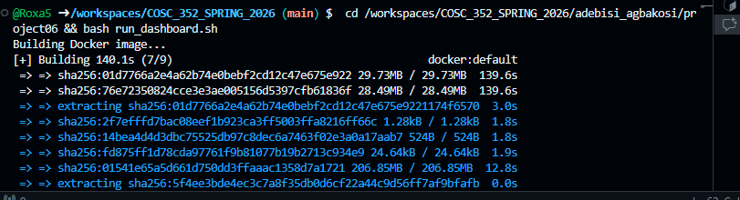

Student: Adebisi Agbakosi

Course: Data Processing

Date: March 13, 2026

Project Overview
This project is an interactive evolution of the homicide analysis started in Project 5. I have transitioned from a static histogram to a Shiny-based command dashboard designed for the Baltimore City Police Department. The app scrapes live data from Chamspage Baltimore Crime Log to provide real-time insights into crime patterns.

Features
1. Enhanced Data Scraping (Part 2 Update)
Unlike Part 1 which focused on a single year, this version pulls data for 2024 and 2025. I improved the rvest pipeline to handle the messy HTML tables across different blog posts, extracting:

Victim Age & Gender

Incident Method (Shooting, Stabbing, etc.)

Case Status (Open/Closed)

Geographic District

2. Interactive Visualizations
Year-over-Year Trends: A dynamic Plotly histogram showing incident volume. Users can compare 2024 vs 2025 to see if specific months are seeing higher rates of violence.

Method Analysis: A bar chart that updates based on the selected district, showing which types of weapons are most prevalent in specific areas.

3. User Controls
Age Range Slider: Filters the entire dashboard to focus on specific demographics (e.g., juveniles vs. adults).

Method Filter: Checkbox group allowing users to isolate shootings, stabbings, or other methods.

Dynamic Sidebar: Built using shinydashboard for a clean, professional "briefing-room" feel.

4. Live KPI Panel
Three reactive value boxes at the top of the screen display:

Total Incidents: Count based on current filters.

Average Age: Real-time calculation of victim demographics.

Clearance Rate: Percentage of cases marked as "Closed" in the scraped data.

Docker & Deployment
I have updated the environment to support a persistent Shiny server.

Dockerfile: Uses rocker/shiny:latest and installs system dependencies for xml2 and ssl required for scraping.

Port Mapping: The container exposes port 3838.

Instructions to Run:
Ensure Docker is running.

Execute the launch script:

Bash
chmod +x run_dashboard.sh
./run_dashboard.sh
(wait for the script to run fully)
Open your browser to: http://localhost:3838

Screenshots
Main Dashboard View: 

Data Cleaning Assumptions
Age Data: Records with missing ages were omitted from the average calculation but kept for total volume counts.

Case Status: I used regex to identify keywords like "Closed" or "Arrest" to calculate the clearance rate KPI.

Method Mapping: Grouped various descriptions  into a general "Shooting" category for cleaner visualization.