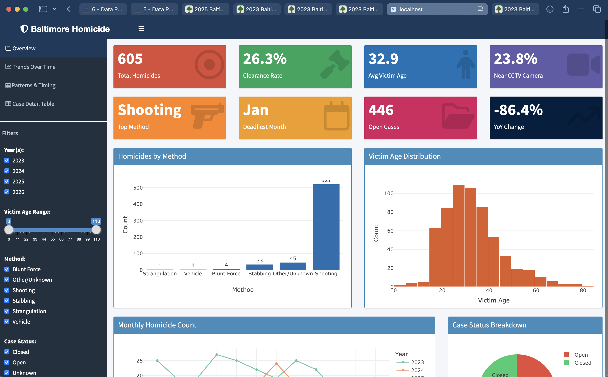
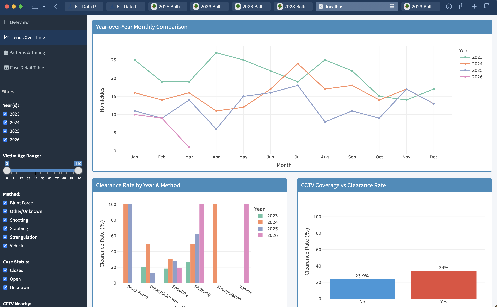
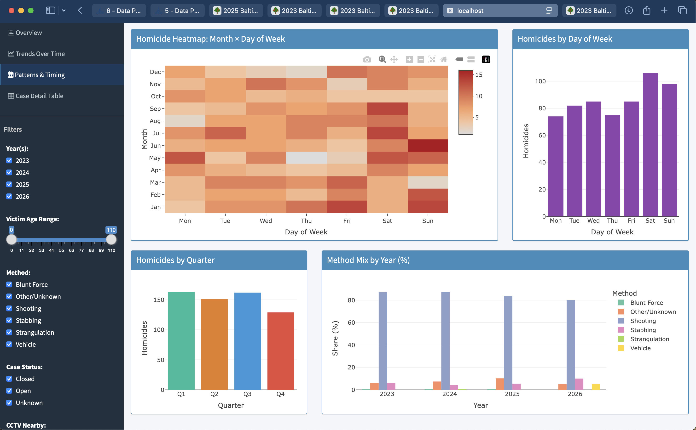
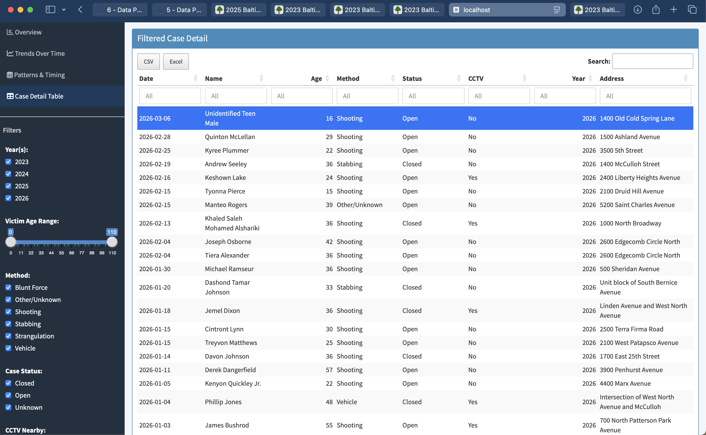

# Baltimore City Homicide Analysis

A two-part project that scrapes, parses, and visualizes Baltimore City homicide data from [Cham's Blog](https://chamspage.blogspot.com/).

---

## Part 1 — Static Histogram

Produces two publication-ready histograms from the 2025 homicide list:

| Output | Description |
|---|---|
| `histogram.png` | Victim age distribution (5-year bins) |
| `histogram_by_method.png` | Homicide method breakdown (keyword-inferred) |

### Run Part 1

```bash
chmod +x run.sh
./run.sh
```

The script builds the Docker image, runs `histogram.R`, and prints the tabular histogram to stdout.

---

## Part 2 — Interactive Shiny Dashboard

A full-featured interactive dashboard designed for detectives, commanders, and analysts to explore homicide trends.

### Features

| Section | Contents |
|---|---|
| **Overview** | 8 live summary stat boxes + 4 charts (method bar, age histogram, monthly trend, case status pie) |
| **Trends Over Time** | Year-over-year monthly comparison, clearance rate by method & year, CCTV vs. clearance scatter, age-by-method violin plots |
| **Geographic View** | Interactive Leaflet map with color-coded case status markers + day-of-week and quarterly bar charts |
| **Case Detail Table** | Searchable, filterable, exportable (CSV/Excel) table of all individual records |

### Filter Controls (sidebar — apply across all tabs)

- **Year(s):** Multi-select checkboxes (2023, 2024, 2025)
- **Victim Age Range:** Slider (0–110)
- **Method:** Multi-select checkboxes (Shooting, Stabbing, Blunt Force, etc.)
- **Case Status:** Closed / Open / Unknown
- **CCTV Nearby:** Yes / No / Unknown
- **Refresh Data:** Clears cache and re-scrapes live from Cham's blog

### Summary Stats (always visible, update with filters)

- Total homicides in filtered view
- Clearance rate (%)
- Average victim age
- % of incidents near a CCTV camera
- Most common method
- Deadliest month
- Open case count
- Year-over-year change (%)

### Run the Dashboard

```bash
chmod +x run_dashboard.sh
./run_dashboard.sh
```

Then open **http://localhost:3838** in your browser. Allow ~10 seconds on the first visit for the app to scrape and parse live data.

**To stop:**
```bash
docker rm -f baltimore-dashboard
```

**To view logs:**
```bash
docker logs -f baltimore-dashboard
```

### Data Pipeline

The app reuses the Part 1 scraping and parsing logic (`scrape_year()`) extended to support multiple years (2023–2025). On first load it fetches live data from Cham's blog and caches the result to `homicide_data_cache.rds`. Subsequent visits use the cache. Click **Refresh Data** in the sidebar to force a re-scrape.

### Requirements

- Docker (Desktop or Engine) installed and running
- Internet access (to scrape Cham's blog on first load)
- No other local dependencies

---

## File Structure

```
.
├── histogram.R          # Part 1 scraping + histogram script
├── app.R                # Part 2 Shiny dashboard
├── Dockerfile           # Shared Docker image (Shiny Server + all packages)
├── run.sh               # Part 1 entry point
├── run_dashboard.sh     # Part 2 entry point
└── README.md
```

---

## Screenshots
### Overview


### Trends Over Time


### Patterns & Timing


### Case Detail Table



---

## Notes & Limitations

- **Method** and **CCTV** fields are inferred from keyword matching in the raw table text. Accuracy depends on how consistently the blog formats entries.
- **Map locations** are approximated with random jitter around Baltimore's city center. Real geocoding would require a geocoding API key (Google Maps, Census, etc.).
- Cham's blog may change its HTML structure over time. If scraping fails, check the column detection logic in `app.R`.