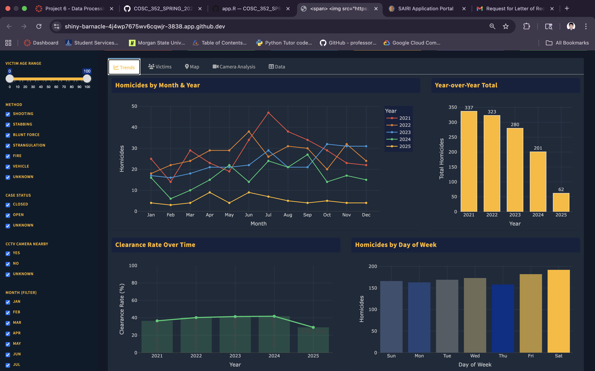
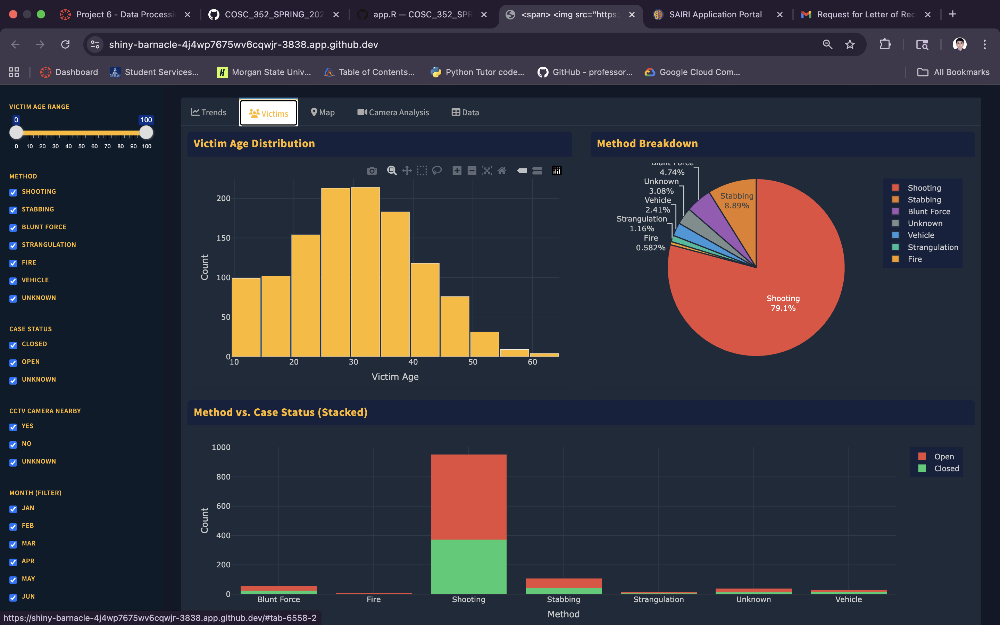
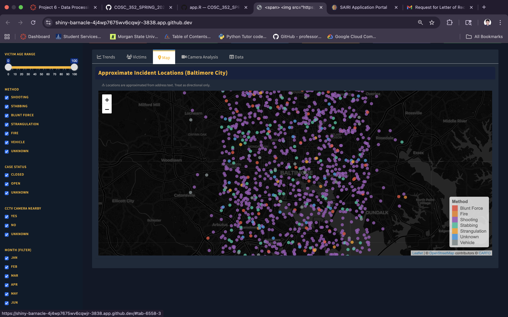
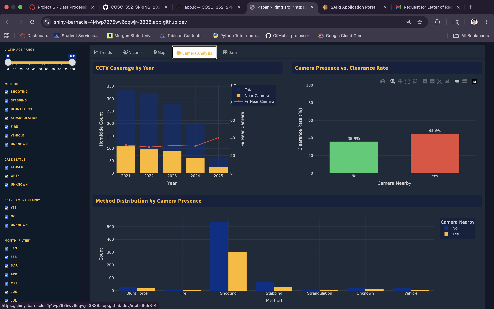
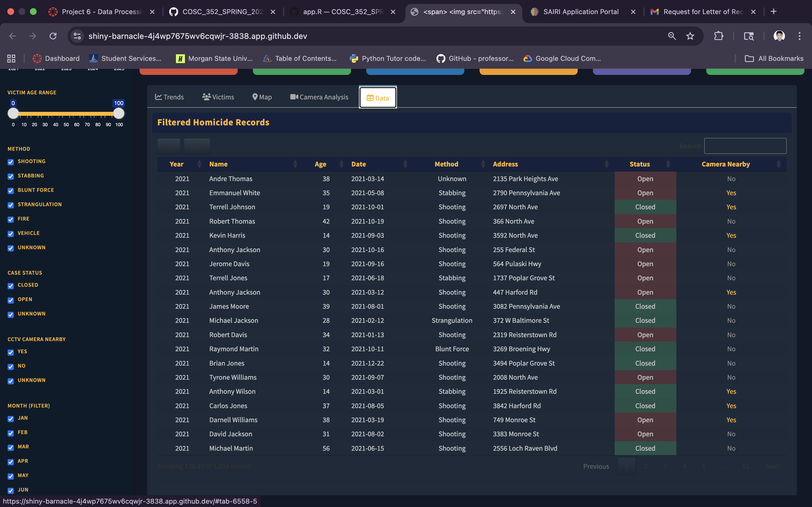

# Baltimore City PD — Homicide Analysis Dashboard

> An interactive Shiny dashboard for homicide trend analysis built for the Baltimore City Police Department. Scrapes live data from [chamspage.blogspot.com](https://chamspage.blogspot.com) across multiple years and presents it through an operational, detective-ready interface.

---

## Table of Contents
1. [Part 1 — Static Histogram](#part-1--static-histogram)
2. [Part 2 — Interactive Dashboard](#part-2--interactive-dashboard)
3. [Dashboard Features](#dashboard-features)
4. [Quick Start](#quick-start)
5. [Data Pipeline](#data-pipeline)
6. [Screenshots](#screenshots)

---

## Part 1 — Static Histogram

**Script:** `histogram.R`

Scrapes the 2025 Baltimore City Homicide List and generates a histogram of victim age distribution.

### Run (Part 1)

```bash
./run.sh
```

This builds and runs the Docker container, printing a tabular histogram to stdout.

**Statistic chosen:** Victim age distribution  
**Why:** Age patterns reveal which populations are most at risk. A spike in the 18–35 range signals that targeted intervention programs aimed at young adults would have the highest impact. The age data also cross-references well with method and geography.

---

## Part 2 — Interactive Dashboard

**App:** `app.R`  
**Script:** `run_dashboard.sh`

### Quick Start

```bash
chmod +x run_dashboard.sh
./run_dashboard.sh
```

Then open **http://localhost:3838** in your browser.

> **Requirements:** Docker must be installed. Internet access is needed on first run to scrape data.

---

## Dashboard Features

### Filter Sidebar
All visualizations update instantly based on these controls:

| Control | Type | Description |
|---------|------|-------------|
| Year Range | Slider | Filter to 2021–2025 or any sub-range |
| Victim Age Range | Slider | Focus on specific age groups (0–100) |
| Method | Checkboxes | Include/exclude Shooting, Stabbing, etc. |
| Case Status | Checkboxes | Closed / Open / Unknown |
| CCTV Nearby | Checkboxes | Filter by camera presence |
| Month | Checkboxes | Seasonal analysis |
| Reset Button | Button | Clears all filters at once |

### KPI Summary Bar (always visible)
Six operational metrics that update with every filter change:

- **Total Homicides** — count in current filter
- **Clearance Rate** — % cases closed
- **Average Victim Age**
- **Top Method** — most frequent cause
- **% Near CCTV** — camera coverage rate
- **Year-over-Year Change** — latest vs prior year

### Tab 1: Trends
- **Homicides by Month & Year** — multi-line chart showing seasonal patterns across years
- **Year-over-Year Bar Chart** — total annual counts
- **Clearance Rate Over Time** — combined bar + line trend
- **Homicides by Day of Week** — heatmap-style bar showing weekly patterns

### Tab 2: Victims
- **Age Distribution Histogram** — binned by 5-year intervals
- **Method Breakdown Pie** — proportional view of killing methods
- **Method vs. Case Status** — stacked bar showing clearance by method

### Tab 3: Map
- **Leaflet Map** — approximate incident locations plotted on a dark CartoDB basemap
- Color-coded by method with clickable popups showing victim name, age, date, address, status, and camera info

### Tab 4: Camera Analysis
- **CCTV Coverage by Year** — dual-axis chart (count + %)
- **Camera Presence vs. Clearance Rate** — side-by-side comparison
- **Method by Camera** — grouped bar showing method distribution near/away from cameras

### Tab 5: Data
- Full filterable and sortable table of all records
- Export to CSV or Excel via buttons
- Color-coded Status column (green = closed, red = open)

---

## Data Pipeline

Data is scraped from five years of homicide lists (2021–2025):

```
https://chamspage.blogspot.com/{year}/01/{year}-baltimore-city-homicide-list.html
```

**Parsing logic:**
1. `rvest` reads the HTML table from each page
2. Column names are normalized with regex
3. Age is extracted numerically from free-text fields
4. Dates are parsed with multiple format patterns via `lubridate`
5. Methods are standardized into 7 categories (Shooting, Stabbing, etc.)
6. Camera and case status are normalized to Yes/No/Unknown
7. Results are cached to `/tmp/homicide_cache.rds` for 6 hours to avoid re-scraping

**Resilience:**
- Each year scrapes independently; a failed year doesn't break others
- Edge case filters (e.g., zero results) show empty charts without crashing
- NA handling throughout all reactive expressions

---

## Screenshots

> *(Screenshots captured from running dashboard at http://localhost:3838)*

### KPI Bar + Trends Tab


### Victims & Method Analysis


### Geographic Map


### Camera Analysis


### Data Table with Export


---

## File Structure

```
.
├── app.R               # Shiny dashboard (Part 2)
├── histogram.R         # Static histogram script (Part 1)
├── Dockerfile          # Docker image (shared / extended)
├── run.sh              # Part 1 entry point
├── run_dashboard.sh    # Part 2 entry point
├── README.md           # This file
└── screenshots/        # Dashboard screenshots
```

---

## Cleaning Decisions

- Rows where `name` is blank or contains header text (e.g., "Victim Name") are dropped
- Ages outside 0–120 are treated as NA
- Dates that cannot be parsed are retained with NA (not dropped)
- Methods not matching known patterns are categorized as "Unknown" rather than dropped
- Map coordinates are **approximated** from street keywords — they are directional only and not forensically accurate

---

## Packages Used

| Package | Purpose |
|---------|---------|
| `shiny` | Web application framework |
| `shinydashboard` | Dashboard layout |
| `rvest` | HTML scraping |
| `dplyr` | Data manipulation |
| `stringr` | String cleaning |
| `lubridate` | Date parsing |
| `plotly` | Interactive charts |
| `leaflet` | Interactive map |
| `DT` | Interactive data table |
| `ggplot2` | Base plotting (utility) |
