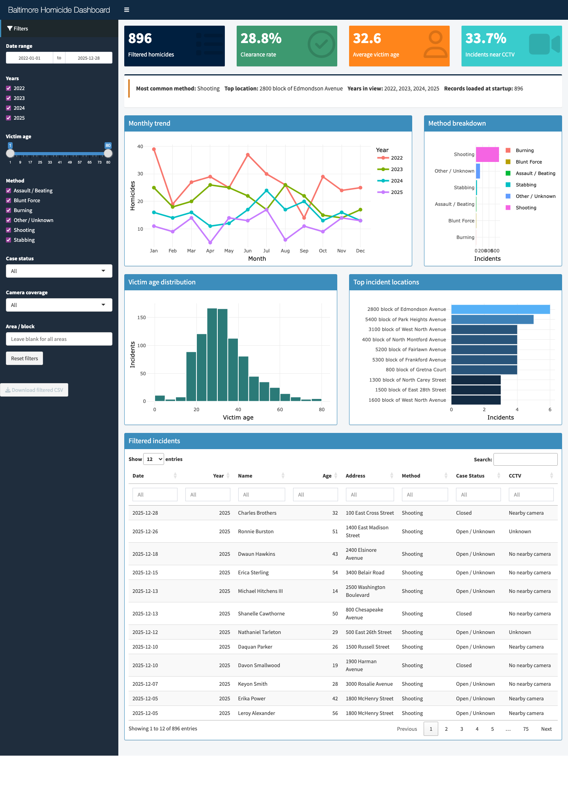

# Baltimore Homicide Dashboard

This project is a Shiny dashboard for exploring Baltimore City homicide data from Cham's blog. It reuses the same scraping idea from Part 1, but turns it into an interactive dashboard that a police analyst could use to filter the data and look for patterns.

## What the dashboard shows

- Total homicides in the current filter
- Clearance rate
- Average victim age
- Percent of incidents with nearby CCTV
- Monthly homicide trend by year
- Method breakdown
- Victim age distribution
- Top incident locations
- A searchable table of filtered incidents

## Filters

The left sidebar lets the user filter by:

- Date range
- Year
- Victim age range
- Method
- Case status
- Camera coverage
- Area / block

All charts, summary boxes, and the data table update when the filters change.

## Data source

The app scrapes homicide records from:

- <https://chamspage.blogspot.com/2025/01/2025-baltimore-city-homicide-list.html>
- <https://chamspage.blogspot.com/2024/01/2024-baltimore-city-homicide-list.html>
- <https://chamspage.blogspot.com/2023/>
- <https://chamspage.blogspot.com/2022/>

The HTML is messy, so the app cleans the rows and extracts:

- year
- date
- victim name
- victim age
- address / block
- method
- case status
- camera information

If the live scrape fails, the app falls back to `homicides_cache.csv`.

## Why I chose these visuals

I kept the dashboard simple and focused on questions a commander could actually ask:

- Are homicides higher in some months than others?
- Which methods happen most often?
- What ages are most common among victims?
- Which blocks show up the most?
- How many filtered cases are cleared?
- How often are incidents near CCTV cameras?

The monthly trend and location chart are especially useful because they help show time patterns and repeat locations.

## How to run

From this folder, run:

```bash
./run_dashboard.sh
```

Then open:

```text
http://localhost:3838
```

To stop the container:

```bash
docker stop oluwasegun-project06-dashboard
```

## Files

- `app.R` - Shiny app, scraping logic, filters, charts, and table
- `Dockerfile` - builds the R/Shiny environment
- `run_dashboard.sh` - builds and runs the dashboard container
- `homicides_cache.csv` - cached data for fallback use
- `dashboard_screenshot.png` - screenshot of the running app

## Screenshot


